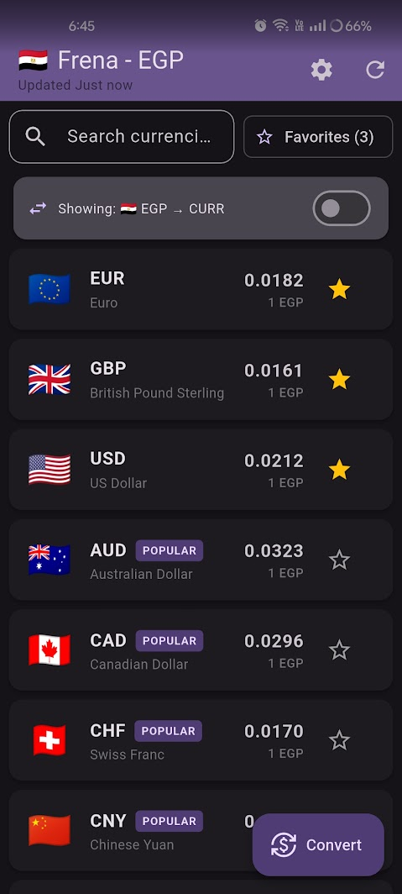
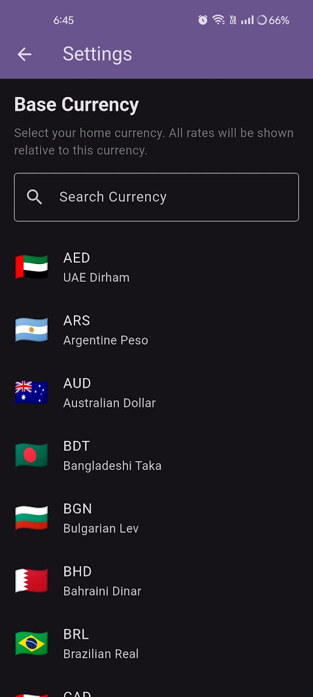
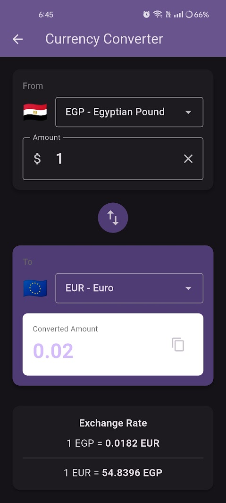

# Frena (Forex Arena)


> Frena demystifies foreign exchange for everyday life. Our mission is to break down financial barriers by providing instant, clear, and accurate currency conversion, empowering you to make confident decisions in a connected world.

---

## About The Project

In a globalized world, understanding the value of foreign money is essential for travelers, online shoppers, freelancers, and more. Frena was built to solve this problem by providing a simple, fast, and reliable currency conversion tool that works both online and offline.

This project is an open-source mobile application built with Flutter.

## Features

*   **Real-Time Exchange Rates:** Get the latest rates for over 160 currencies.
*   **Intelligent Currency Converter:** A beautiful, intuitive interface to convert between currencies with live updates.
*   **User-Defined Base Currency:** Set your home currency for a personalized experience.
*   **Favorites System:** Mark your frequently used currencies as favorites for quick access.
*   **Search Functionality:** Quickly find any currency by code or name.
*   **Offline Mode:** The app caches the last fetched rates, so it's always available, even without an internet connection.
*   **Comprehensive Currency List:** View a full list of exchange rates with currency flags and full names.
*   **Smart Sorting:** Favorites appear first, followed by popular currencies, then alphabetically.
*   **Copy to Clipboard:** Easy one-tap copying of converted amounts.
*   **Beautiful UI:** Modern Material Design 3 with smooth animations and responsive layout.
*   **Dark Mode Support:** Automatically adapts to system theme preferences.

## Tech Stack

*   **Framework:** [Flutter](https://flutter.dev/)
*   **Language:** [Dart](https://dart.dev/)
*   **State Management:** `setState` (simple, built-in)
*   **API Handling:** `http` package
*   **Local Storage:** `sqflite` for SQLite database
*   **Date Formatting:** `intl` package

## Screenshots

| Currency List | Base currency |
| :---: | :---: |
|  |  |

| Converter |  
| :---: |
|  |


## Architecture Overview

Frena is built using the Flutter framework and the Dart language. The architecture is designed to be simple and maintainable, consisting of three main parts:

1.  **UI Layer:** The user interface is built with Flutter's Material Design widgets. It consists of two main screens: `CurrencyListPage` and `ConverterScreen`.
2.  **Services Layer:**
    *   `ApiService`: Handles all communication with the external currency exchange rate API (ExchangeRate-API).
    *   `DatabaseHelper`: Manages the local SQLite database for caching currency rates, enabling offline functionality.
3.  **Data Layer:**
    *   **Remote:** Fetches live data from the [ExchangeRate-API "Open API"](https://www.exchangerate-api.com).
    *   **Local:** A SQLite database stores the most recent rates for offline access.

## Repository Structure

```
├── android/                    # Android-specific files
├── ios/                        # iOS-specific files
├── lib/
│   ├── api_service.dart        # Handles API communication
│   ├── converter_screen.dart   # Enhanced currency converter screen UI
│   ├── currency_data.dart      # Currency information (names, flags, popular list)
│   ├── database_helper.dart    # Manages the local SQLite database
│   ├── main.dart               # Main app entry point and currency list screen
│   ├── preferences_service.dart # User preferences management
│   └── settings_screen.dart    # Settings and base currency selection
├── test/                       # Application tests
├── pubspec.yaml                # Project dependencies and configuration
└── README.md                   # This file
```

## Getting Started

To get a local copy up and running, follow these simple steps.

### Downloads

You can download the latest release APK directly from the [**GitHub Releases**](https://github.com/alisamirs/frena/releases) page.

### Installation & Running from Source

1.  **Prerequisites:**
    *   **Flutter SDK:** Make sure you have the Flutter SDK installed. For installation instructions, see the [official Flutter documentation](https://flutter.dev/docs/get-started/install).

2.  **Clone the repo:**
    ```sh
    git clone https://github.com/alisamirs/frena.git
    ```
3.  **Navigate to the project directory:**
    ```sh
    cd frena
    ```
4.  **Install dependencies:**
    ```sh
    flutter pub get
    ```
5.  **Run the app:**
    ```sh
    flutter run
    ```

## Logo


---